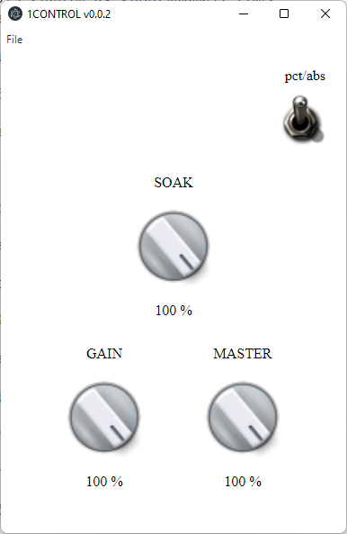

# 1CONTROL App for Bluguitar AMP1

1CONTROL is developed to give an easy access to the features the hardware 1CONTROL does. It is built with the [electron framework](https://www.electronjs.org/). It can be run on Windows, Linux and MacOS.

## Release

Downloads:
[Releases](https://github.com/sami1979/1CONTROL/releases)

## Q&A

**Q: What do I need to use the !CONTROL App?**

**A:** First of all you need an Bluguitar AMP1 :grin:. You need a Midi Interface for your computer device and the [Bluguitar MIDI1 adapter](https://bluguitar.com/en/products/accessoires/midi1).